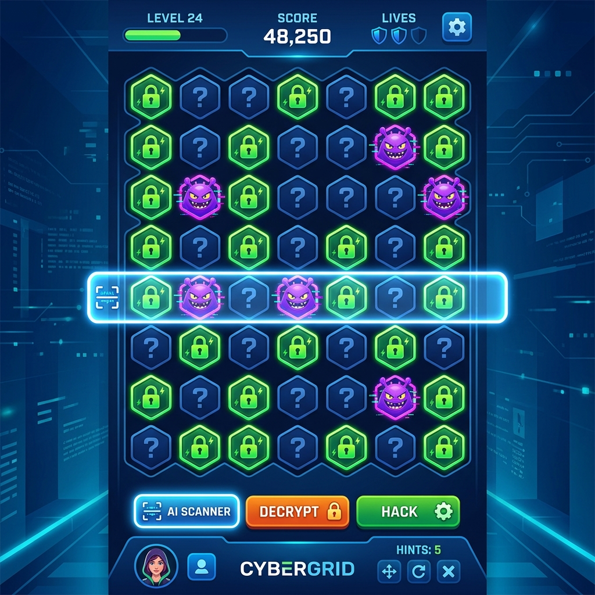
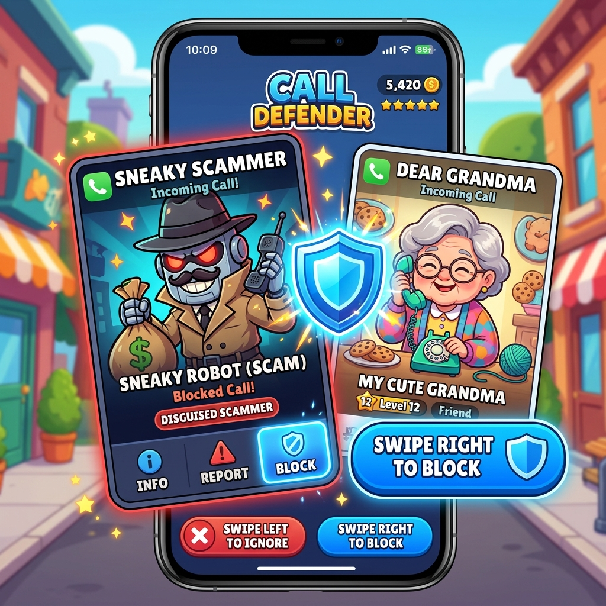

# Partyhat MiniGames 🛡️🎮

A collection of high-performance, security-themed mini-games designed for the **Partyhat** mobile security ecosystem. These games combine modern web aesthetics with educational gameplay mechanics centered around cybersecurity.

## 🕹️ Featured Game: Data Dash

**Data Dash** is an endless runner where you take control of a data packet navigating a public Wi-Fi tunnel. Your mission is to survive the digital onslaught of malware, trackers, and snoops to secure your connection.

### Gameplay Mechanics:
- **Survival**: Hold out for **45 seconds** to successfully encrypt your connection.
- **Encryption Mode**: Collect the **Shield Power-up** to enter Encryption Mode, making you invincible and allowing you to smash through obstacles for bonus points.
- **Obstacles**:
  - 🔴 **Malware**: Instant data breach (Game Over).
  - 🟡 **Trackers**: Slows down your connection and reduces score.
  - 🟣 **Snoops**: Causes visual glitches and reduces score.

### Visual Concepts:




---

## 🚀 How to Run Locally

Since these are pure HTML5/JS games, no installation is required:

1. Clone the repository:
   ```bash
   git clone https://github.com/[YOUR-USERNAME]/PartyhatMiniGames.git
   ```
2. Open `data_dash.html` in any modern web browser (Chrome, Safari, Firefox).
3. Play using **Arrow Keys** or **A/D** (Desktop) or **Touch** (Mobile).

---

## 🛠️ Tech Stack
- **Engine**: Vanilla JavaScript (Canvas API)
- **Styling**: Modern CSS3 with Glassmorphism and Neon aesthetics.
- **Typography**: Inter (via Google Fonts).

## 📄 License
This project is licensed under the [MIT License](LICENSE).

---
*Created with ❤️ for the Partyhat Security Community.*
